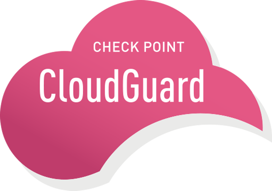

#cloudguardk8s
----------------

This is a really simple scirpt which automates onboarding your Kubernetes cluster to CloudGuard CSPM (Dome9) - just another anternative to using Helm. I've created both Python and Bashshell scripts that basically do the same thing. Either script requires that you already have access to a CloudGuard CSPM account, have installed kubectl and obtained CloudGuard API Key and Secret. Of course Python verstion of the script requires that you've installed Python 3.x. You just need to run either one.

Python
---
Just run the script, and it'll ask for necessary information to onboard/remove the cluster to CloudGuard. 

For example:

```bash
# Install requirements
pip3 install -r requirements.txt
# Execute script
python3 onboardk8s.py onboard
python  onboardk8s.py remove
```

For cluster onboarding you will need to provide:

1. Your Cluster Name (e.g. my_cluster)
2. Namespace (e.g. checkpoint)
3. CloudGuard API Key (you can export environment variable CHKP_CLOUDGUARD_ID and script will detect it)
4. CloudGUard API Secret (you can export environment variable CHKP_CLOUDGUARD_SECRET and script will detect it)

For cluster removal you will need to provide:

1. The path to the yaml file that was generated during onboarding. Script will try to find a yaml file in current directory
2. CloudGuard API Key (you can export environment variable CHKP_CLOUDGUARD_ID and script will detect it)
3. CloudGUard API Secret (you can export environment variable CHKP_CLOUDGUARD_SECRET and script will detect it)


Bash shell
---

Just run the shell script, and it'll ask for necessary information (e.g. cluster name to onboard the cluster to CloudGuard.

For example, "./onboardk8s_sh.sh"

You'll need to provide;

1. Your Cluster Name (e.g. my_cluster)
2. namespace (e.g. checkpoint)
3. CloudGuard API Key
4. CloudGUard API Secret

Sample Output
----
```bash
$ ./onboardk8s_sh.sh \
Enter Your Cluster Name: cloudguarder1 \
Enter Namespace: checkpoint \
Enter CloudGuard API Key: [YOUR CLOUDGUARD API KEY] \
Enter CloudGuard API Secret: [YOUR CLOUDGUARD API SECRET] \
your CloudGuard cluster ID is [YOUR CLOUDGUARD ID] \
Hello, CloudGuarder! We are onboarding cloudguarder1 to CloudGuard. Give us a moment. \
Creating namespace.. \
namespace/checkpoint created \
Creating CloudGuard Token.. \
secret/dome9-creds created \
Configuration map.. \
configmap/cp-resource-management-configmap created \
Finalising onboarding.. \
serviceaccount/cp-resource-management created \
clusterrole.rbac.authorization.k8s.io/cp-resource-management created \
clusterrolebinding.rbac.authorization.k8s.io/cp-resource-management created
Deploying CloudGuard agent.. \
deployment.apps/cp-resource-management created \ 
Well done, Cloudguarder! cloudguarder1 has been succcessfuly onboarded to CloudGuard!
```

If you don't have a cloudguard CSPM account yet, register at https://secure.dome9.com/v2 for a free trial account today!
----
 

